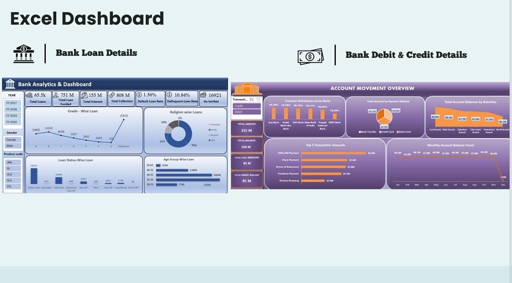
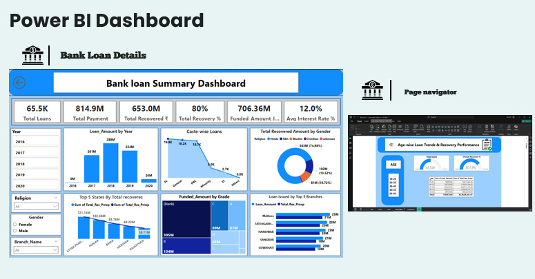

🏦 Banking Analytics
-
A comprehensive Banking Data Analytics Project designed to transform raw transaction data into meaningful insights using Excel, Power BI, Tableau, and MySQL. The project focuses on credit/debit transaction analysis, customer behavior, and financial reporting, providing an end-to-end data journey from data cleaning to interactive dashboards.

📊 Project Objectives
---
Collect, clean, and analyze raw banking data.

Perform SQL-based querying for deep insights.

Build dashboards to visualize:

Credit & Debit transaction trends

Customer behavior & spending patterns

Monthly/Yearly financial performance

Enable data-driven decision making in the banking sector.

🔹 Features
---
✔️ SQL Data Analysis – Queries to extract, aggregate, and filter transaction insights.
✔️ Excel Dashboards – Pivot tables, charts, and KPI tracking.
✔️ Power BI Reports – Interactive reports with filters and slicers.
✔️ Tableau Visualizations – Advanced storytelling dashboards.
✔️ End-to-End Workflow – From raw data → SQL processing → visualization.

🛠️ Tools & Technologies
-
MySQL – Data storage, querying, and preprocessing.

Excel – Data cleaning, pivot charts, dashboard creation.

Power BI – Interactive analytics and visualization.

Tableau – Advanced data visualization and insights.
- **Preview:**
- Designed an Excel Banking Dashboard to track loan performance, customer transactions, and account balance trends, providing actionable insights for financial analysis. 
  
- **Preview:**
- Developed an interactive Power BI Loan Summary Dashboard with drill-down analysis on loan trends, recovery performance, and borrower demographics to support data-driven financial decisions.
  
---

🚀 Applications
---
Helps financial analysts track credit/debit patterns.

Provides management dashboards for strategic decision making.

Useful for students & professionals to learn multi-tool analytics.

Can be extended for fraud detection, risk analysis, and forecasting.

📌 Future Enhancements
---
Automating SQL data pipeline with Python/ETL tools.

Adding Machine Learning models for fraud detection & predictions.

Expanding dataset for real-world banking case studies.

⭐ If you find this project useful, don’t forget to star this repo!

## 👤 Author

**Elluri Imran**  
📌 [GitHub Profile](https://github.com/Elluriimran)

---

✨ *This project demonstrates how Banking data can be transformed into actionable insights using multiple BI tools.*

